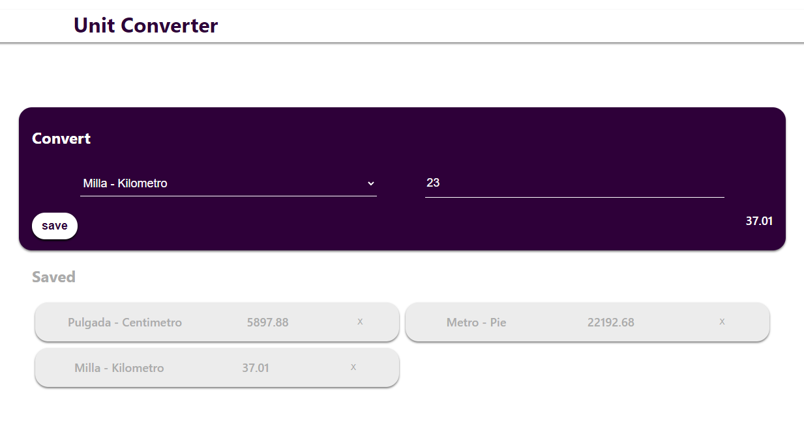
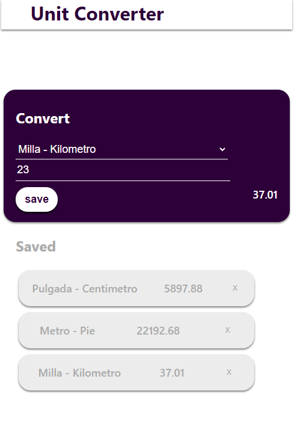

# React + Vite

- Errores o Cosas que no he conseguido:

  .- No he usado redux, nuca antes lo habia usado y lo queria hacer con lo que ya sabia.
  .- En Form.jsx y ServedItems.jsx me marcan como errores por los props y por usar map, no he conseguido solucionarlo.
  .- No he coseguido hacer que funcione bien el localStorage, estoy casi seguro que es por los errores anteriores porque en principio ne veo fallos en el codigo ni he encontrado nada.

- Web
  

- Mobile
  

- [@vitejs/plugin-react](https://github.com/vitejs/vite-plugin-react/blob/main/packages/plugin-react/README.md) uses [Babel](https://babeljs.io/) for Fast Refresh
- [@vitejs/plugin-react-swc](https://github.com/vitejs/vite-plugin-react-swc) uses [SWC](https://swc.rs/) for Fast Refresh
